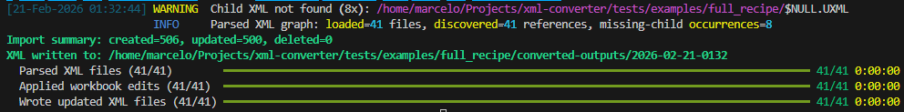
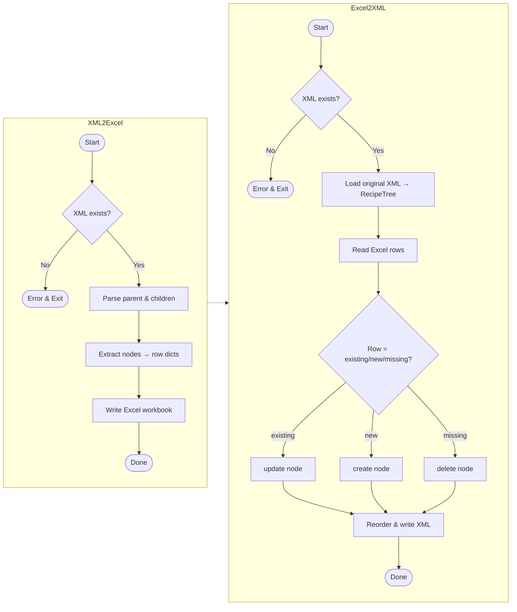

# Bulk Editor for FactoryTalk Batch Recipes

[](https://github.com/marcelo-6/ftbatch-bulk-edit/actions/workflows/ci.yml)
[](https://github.com/marcelo-6/ftbatch-bulk-edit/actions/workflows/publish-pypi.yml)
[](https://github.com/marcelo-6/ftbatch-bulk-edit/actions/workflows/ci.yml)
[](https://pypi.org/project/ftbatch-bulk-edit/)

A command-line tool (Python-based) that lets engineers bulk-edit Rockwell FactoryTalk Batch S88 recipes (`.pxml`, `.uxml`, and `.oxml`) by round-tripping through Excel. You can **export** your recipes (including any child references) into a spreadsheet, make batch changes to parameters and formula-values, then **import** the edits back to produce updated XML files—preserving element order, empty tags, and original structure.

---

## Table of Contents

- [Bulk Editor for FactoryTalk Batch Recipes](#bulk-editor-for-factorytalk-batch-recipes)
  - [Table of Contents](#table-of-contents)
  - [Features](#features)
  - [Requirements](#requirements)
  - [Installation](#installation)
    - [Using pip](#using-pip)
    - [Using a Python Virtual Environment](#using-a-python-virtual-environment)
    - [Using uv as the Package Manager](#using-uv-as-the-package-manager)
    - [Using the Justfile (Recommended)](#using-the-justfile-recommended)
  - [Usage Overview](#usage-overview)
    - [Export XML to Excel (`xml2excel`)](#export-xml-to-excel-xml2excel)
    - [Import Excel to XML (`excel2xml`)](#import-excel-to-xml-excel2xml)
    - [Global Options](#global-options)
  - [Changelog \& Versioning](#changelog--versioning)
  - [Debug Mode](#debug-mode)
  - [Flow Chart](#flow-chart)
  - [Example Excel Output](#example-excel-output)
  - [Example XML Schema Snippet](#example-xml-schema-snippet)
  - [Preservation Rules \& Edge Cases](#preservation-rules--edge-cases)
  - [Troubleshooting](#troubleshooting)

---

## Features

1. **Bulk Editing in Excel**  
   - Extract top-level `<Parameter>` and step-level `<FormulaValue>` into one sheet per file.  
   - Edit hundreds of tags in your favorite spreadsheet tool.  

2. **Preserve Order & Empties**  
   - Maintains the original element order.  
   - Keeps empty tags (e.g. `<EngineeringUnits/>`, `<String/>`).  
   - Retains existing `<FormulaValueLimit>` blocks unless you remove them.  

3. **Recursive Child Parsing**  
   - A `.pxml` may reference `.uxml`; a `.uxml` may reference `.oxml` via `<StepRecipeID>`.  
   - Exports all related files into one workbook.

4. **Selective Create/Update/Delete**  
   - **Update** if a row’s `FullPath` matches an existing node.  
   - **Delete** if you remove a row entirely.  
   - **Create** if you add a new `FullPath` row (with one valid data-type column).

5. **Detailed Logging**  
   - Console keeps high-signal warnings/summaries with Rich formatting.  
   - DEBUG-level detail (with `--debug`) is written to `batch_bulk_editor.log`.

6. **ParamExpression support**
   - For FormulaValues you can now supply a real‐time expression.
   - In Excel, fill the appropriate data‐type column (Real/Integer/String) with the literal `ParamExpression`, and put the actual expression into the new **ParamExpression** column (appearing right after Defer).
   - On import, the tool will generate a `<ParamExpression/>` tag, insert your formula into `<Real>` (or `<Integer>`, etc.), and preserve correct XML ordering.




---

## Requirements

- **Python 3.14 only**
- **lxml**
- **openpyxl**

---

## Installation

### Using pip

1. **Clone** this repo.  
2. **Install** dependencies:

   ```bash
   pip install lxml openpyxl
   ```

3. **Run**:

   ```bash
   python app/main.py xml2excel --xml yourRecipe.pxml --excel out.xlsx
   ```

### Using a Python Virtual Environment

1. ```bash
   python -m venv venv
   ```
2. Activate it:

   * Windows: `venv\Scripts\activate`
   * macOS/Linux: `source venv/bin/activate`
3. Install:

   ```bash
   pip install lxml openpyxl
   ```
4. Run:

   ```bash
   python app/main.py xml2excel --xml yourRecipe.pxml --excel out.xlsx
   ```

### Using uv as the Package Manager

```bash
uv sync --python 3.14
uv run python app/main.py xml2excel --xml yourRecipe.pxml --excel out.xlsx
```

### Using the Justfile (Recommended)

We provide a `justfile` to automate setup, testing, linting, coverage, and executable builds:

```bash
just help         # list recipes
just sync         # install deps for Python 3.14
just test         # run tests
just lint         # run Ruff lint checks
just cov          # run tests with coverage threshold
just bump-dry-run # print next semver from unreleased commits
just changelog-unreleased # preview unreleased section
just changelog-dry-run   # preview unreleased section with bumped version
just release-dry-run     # show current/next version + release notes preview
just changelog    # write full CHANGELOG.md from git tags
just version-info # generate build/version_info.txt
just build        # build one-file executable with PyInstaller
just clean        # remove generated artifacts
```

---

## Usage Overview

### Export XML to Excel (`xml2excel`)

```bash
python app/main.py [GLOBAL_OPTIONS] xml2excel --xml PATH_TO_XML --excel OUTPUT_XLSX
```

| Argument  | Description                                                                       |
| --------- | --------------------------------------------------------------------------------- |
| `--xml`   | Parent file (`.pxml`, `.uxml`, or `.oxml`). Children loaded via `<StepRecipeID>`. |
| `--excel` | Destination Excel workbook.                                                       |

### Import Excel to XML (`excel2xml`)

```bash
python app/main.py [GLOBAL_OPTIONS] excel2xml --xml PATH_TO_XML --excel EDITED_XLSX
```

| Argument  | Description                                  |
| --------- | -------------------------------------------- |
| `--xml`   | Same parent file used for export.            |
| `--excel` | Edited Excel workbook.                       |

### Global Options

| Option | Description |
| --- | --- |
| `--debug` | Write DEBUG logs to `batch_bulk_editor.log`. |
| `--progress` | Force rich progress bars on. |
| `--no-progress` | Disable progress bars (recommended for CI/piped logs). |
| `--version` | Show CLI version and exit. |
| `--help` | Show command help. |

---

## Changelog & Versioning

`git-cliff` is configured as the changelog and version-bump engine (`cliff.toml`).  
The future GitHub release pipeline will be responsible for writing changelog updates, tagging, and publishing releases.

Local dry-run workflow:

```bash
just bump-dry-run       # prints next semantic version from unreleased commits
just changelog-unreleased   # preview unreleased section
just changelog-dry-run      # preview unreleased section rendered as next release
just release-dry-run        # shows current/next version + notes preview
```

When you want to regenerate the full changelog file locally:

```bash
just changelog
```

Dynamic version helpers are available via `scripts/versioning.py` and are used by:
- `scripts/project_meta.py`
- `scripts/generate_version_info.py`
- CLI `--version` fallback resolution

---

## Debug Mode

Add `--debug` before the subcommand to capture detailed logs:

```bash
python app/main.py --debug xml2excel --xml myRecipe.pxml --excel out.xlsx
```

* Creates/appends `batch_bulk_editor.log` at DEBUG level.
* Console logs are rendered with Rich coloring.
* Repeated warning patterns are summarized in console output while debug file logs remain detailed.

Use `--progress` or `--no-progress` before the subcommand to control progress bars:

```bash
python app/main.py --no-progress excel2xml --xml myRecipe.pxml --excel edits.xlsx
```

By default, progress bars are enabled only for interactive terminals.

---

## Flow Chart



---

## Example Excel Output

| FullPath                                                             | TagType      | Name                     | Real | Integer | String | EnumerationSet   | EnumerationMember | Defer            | FormulaValueLimit\_Verification | … |
| -------------------------------------------------------------------- | ------------ | ------------------------ | ---- | ------- | ------ | ---------------- | ----------------- | ---------------- | ------------------------------- | - |
| TEST/Parameter\[XFER5\_TARGET\_CONC\_DB]                             | Parameter    | XFER5\_TARGET\_CONC\_DB  | 0    |         |        |                  |                   |                  |                                 |   |
| TEST/Steps/Step\[ACQ\_REL:1]/FormulaValue\[X\_R\_END\_PHASE\_PROMPT] | FormulaValue | X\_R\_END\_PHASE\_PROMPT |      |         |        | N\_DISABLEENABLE | DISABLE           |                  | No\_Limits                      |   |
| TEST/Steps/Step\[ACQ\_REL:1]/FormulaValue\[X\_R\_END\_TYPE]          | FormulaValue | X\_R\_END\_TYPE          |      |         |        | N\_ENDTYPE       |                   | AQREL\_END\_TYPE | No\_Limits                      |   |

---

## Example XML Schema Snippet

```xml
<xs:element name="Parameter">
  <xs:complexType>
    <xs:sequence>
      <xs:element name="Name" type="xs:string" minOccurs="0"/>
      <xs:element name="ERPAlias" minOccurs="0"/>
      <xs:element name="PLCReference" type="xs:unsignedByte" minOccurs="0"/>
      <xs:element name="Real" type="xs:unsignedShort" minOccurs="0"/>
      <xs:element name="High" type="xs:unsignedShort" minOccurs="0"/>
      <xs:element name="Low" type="xs:unsignedByte" minOccurs="0"/>
      <xs:element name="EngineeringUnits" type="xs:string" minOccurs="0"/>
      <xs:element name="Scale" type="xs:boolean" minOccurs="0"/>
    </xs:sequence>
  </xs:complexType>
</xs:element>

<xs:element name="FormulaValue">
  <xs:complexType>
    <xs:sequence>
      <xs:element name="Name" type="xs:string" minOccurs="0"/>
      <xs:element name="Display" type="xs:boolean" minOccurs="0"/>
      <xs:element name="Value" minOccurs="0"/>
      <xs:element name="Defer" type="xs:string" minOccurs="0"/>
      <xs:element name="Real" type="xs:decimal" minOccurs="0"/>
      <xs:element name="EngineeringUnits" type="xs:string" minOccurs="0"/>
      <xs:element name="FormulaValueLimit" minOccurs="0">
        <xs:complexType>
          <xs:attribute name="Verification" type="xs:string" use="optional"/>
          <xs:sequence>
            <xs:element name="LowValue" type="xs:decimal" minOccurs="0"/>
            <xs:element name="HighValue" type="xs:decimal" minOccurs="0"/>
          </xs:sequence>
        </xs:complexType>
      </xs:element>
    </xs:sequence>
  </xs:complexType>
</xs:element>
```

---

## Preservation Rules & Edge Cases

* **Empty Tags**: If a sub-element existed (even empty), it remains.
* **Create FormulaValueLimit** only if `FormulaValueLimit_*` columns are non-blank or it existed originally.
* **Type Enforcement**: Exactly one of Real, Integer, String, or EnumerationSet per row.
* **Defer Validation**: A `<FormulaValue>`’s `Defer` must match a parameter name in the same sheet.
  * Example output:
```bash
[30-May-2025 14:49:35]  ERROR:  CP_GMP_PROCEDURE.PXML!Row924: defer target 'DSTFP_TEMP_PROC2_TEMP_STATE_CMD' not found for CP_GMP_PROCEDURE/Steps/Step[UP_DSTFP_PROCESS:1]/FormulaValue[TEMP_PROC2_TEMP_STATE_CMD]
```

---

## Troubleshooting

1. **No Sheet Found**

   * Sheet name must match the XML filename (`TEST.pxml` → sheet “TEST.pxml”).
2. **Missing Data-Type**

   * Every Parameter or FormulaValue row must have one and only one data-type column.
3. **Need More Logs?**

   * Add `--debug` to capture detailed steps in `batch_bulk_editor.log`.
