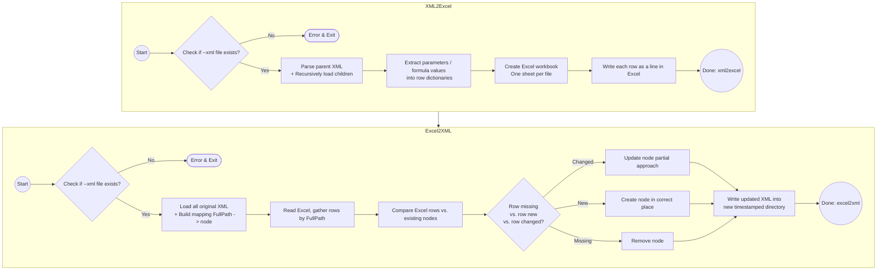

# Bulk Editor for FactoryTalk Batch Recipes

A command‐line tool (Python‐based) that allows bulk editing of Rockwell FactoryTalk Batch S88 recipes (`.pxml`, `.uxml`, and `.oxml` files) by round‐tripping through Excel. Engineers can **export** these XML files (plus their child references) to an Excel workbook, make changes to parameters/formula values in bulk, and then **import** the changes back to produce updated XML files—while preserving order, empty tags, and existing structure.

## Table of Contents

- [Features](#features)
- [Requirements](#requirements)
- [Installation](#installation)
  - [Using pip](#using-pip)
  - [Using a Python Virtual Environment](#using-a-python-virtual-environment)
  - [Using uv as the Package Manager](#using-uv-as-the-package-manager)
- [Usage Overview](#usage-overview)
  - [Export XML to Excel (xml2excel)](#export-xml-to-excel-xml2excel)
  - [Import Excel to XML (excel2xml)](#import-excel-to-xml-excel2xml)
  - [Debug Mode](#debug-mode)
  - [Flow Chart](#flow-chart)
- [Example Excel Output](#example-excel-output)
  - [Example XML Schema Snippet](#example-xml-schema-snippet)
- [Makefile Usage](#makefile-usage)
- [Preservation Rules & Edge Cases](#preservation-rules--edge-cases)
- [Troubleshooting](#troubleshooting)

---

## Features

1. **Bulk Editing in Excel**  
   - Extract top‐level parameters (`<Parameter>`) and step‐level formulas (`<FormulaValue>`) into a spreadsheet.
   - One sheet per XML file, for easy batch editing.

2. **Preservation of Order & Empty Tags**  
   - Original ordering of parameters/formula values remains intact in the updated XML.
   - Empty tags, such as `<EngineeringUnits/>` or `<String/>`, stay preserved.
   - `<FormulaValueLimit>` blocks also remain unless you remove the entire node.

3. **Recursive Parsing of Child XML**  
   - If a `.pxml` references child `.uxml` or `.oxml` (via `<StepRecipeID>`), we automatically include them in the Excel export.

4. **Selective Create/Update/Remove**  
   - Removing a row in Excel removes that node in XML.
   - Adding a row with a new `FullPath` creates a new `<Parameter>` or `<FormulaValue>` in XML.
   - Only sub‐elements that have non‐empty columns are created if missing; otherwise, if a column is empty for a sub‐element that didn’t originally exist, it’s not added.

5. **Detailed Logging**  
   - By default, logs to console at INFO level.
   - With `--debug`, logs at DEBUG level go into `batch_bulk_editor.log`.

---

## Requirements

- **Python 3.7+** (tested with Python 3.12+)
- **lxml** for XML parsing
- **openpyxl** for reading/writing Excel

---

## Installation

You have multiple options for installing dependencies and running the script:

### Using pip

1. **Clone or Download** this repository, ensuring `batch_bulk_editor.py` is present.
2. **Install** dependencies with `pip`:
   ```bash
   pip install lxml openpyxl
   ```
3. **Run** using Python:
   ```bash
   python batch_bulk_editor.py xml2excel --xml yourRecipe.pxml --excel out.xlsx
   ```

### Using a Python Virtual Environment

1. **Create** a virtual environment:
   ```bash
   python -m venv venv
   ```
2. **Activate** the venv:
   - On Windows:
     ```bash
     venv\Scripts\activate
     ```
   - On macOS/Linux:
     ```bash
     source venv/bin/activate
     ```
3. **Install** packages:
   ```bash
   pip install lxml openpyxl
   ```
4. **Run** the tool:
   ```bash
   python batch_bulk_editor.py xml2excel --xml yourRecipe.pxml --excel out.xlsx
   ```

### Using uv as the Package Manager

If you prefer to manage dependencies via [uv](https://astral.sh/blog/uv) and have a `pyproject.toml` included in this repo:

1. **Initialize** uv in your project directory (if you haven’t already):  
   ```bash
   uv init
   ```
   *(This creates a local `.venv` and references your `pyproject.toml`.)*
2. **Install** dependencies from `pyproject.toml`:
   ```bash
   uv install
   ```
3. **Run** the tool via uv’s environment:
   ```bash
   uv run python batch_bulk_editor.py xml2excel --xml yourRecipe.pxml --excel out.xlsx
   ```

*(Behind the scenes, `uv` will create and manage a virtual environment and install packages listed in your `pyproject.toml`.)*

---

## Usage Overview

The script `batch_bulk_editor.py` offers two sub‐commands:

### Export XML to Excel (`xml2excel`)

```bash
python batch_bulk_editor.py xml2excel --xml PATH_TO_XML --excel OUTPUT_EXCEL [--debug]
```

| Argument         | Description                                                                                           |
|------------------|-------------------------------------------------------------------------------------------------------|
| `--xml`          | Path to the “parent” file (e.g. `.pxml`, `.uxml`, or `.oxml`). The tool recursively loads child files by referencing `<StepRecipeID>`. |
| `--excel`        | Path to the output Excel workbook.                                                                    |
| `--debug`        | (Optional) Writes debug logs to `batch_bulk_editor.log` and prints info logs to console.              |

### Import Excel to XML (`excel2xml`)

```bash
python batch_bulk_editor.py excel2xml --xml PATH_TO_XML --excel EDITED_EXCEL [--debug]
```

| Argument         | Description                                                                                            |
|------------------|--------------------------------------------------------------------------------------------------------|
| `--xml`          | Path to the same parent file used in `xml2excel`.                                                     |
| `--excel`        | Path to the Excel workbook that was edited.                                                           |
| `--debug`        | (Optional) Writes debug logs to `batch_bulk_editor.log` and prints info logs to console.              |

---

## Debug Mode

Add `--debug` **before** the sub‐command to enable verbose logs:

```bash
python batch_bulk_editor.py --debug xml2excel --xml myRecipe.pxml --excel out.xlsx
```

- Creates or appends to `batch_bulk_editor.log` with detailed debug info.
- Console logs remain at INFO level.

---

## Flow Chart

Below is a Mermaid diagram illustrating the internal flow of each sub-command:



---

## Example Excel Output

Below is a **simplified** example of a sheet from the Excel file generated by `xml2excel`. Each row corresponds to one `<Parameter>` or `<FormulaValue>`, with columns reflecting sub‐elements (e.g. `String`, `Defer`, or `FormulaValueLimit_Verification`).

| FullPath                                                            | TagType       | Name                  | String | Defer                | Real | FormulaValueLimit_Verification | FormulaValueLimit_LowValue |
|---------------------------------------------------------------------|---------------|-----------------------|--------|----------------------|------|--------------------------------|----------------------------|
| OP_LNP_SETUP/Parameter[AQREL_DEVICE_SETUP]                          | Parameter     | AQREL_DEVICE_SETUP    |        |                      |      |                                |                            |
| OP_LNP_SETUP/Parameter[AQREL_TARE_ZERO_TMOUT]                       | Parameter     | AQREL_TARE_ZERO_TMOUT |        |                      |      |                                |                            |
| OP_LNP_SETUP/Steps/Step[ACQ_REL:1]/FormulaValue[X_R_TARE_ZERO_TIME_OUT_SEC] | FormulaValue | X_R_TARE_ZERO_TIME_OUT_SEC |        | AQREL_TARE_ZERO_TMOUT | 0.0  | No_Limits                      | 0.0                        |

**Notes**:

- **`FullPath`** uniquely identifies where the parameter/formula lives in the S88 hierarchy.  
- **`TagType`** is either `Parameter` or `FormulaValue`.  
- **`FormulaValueLimit_*`** columns store `<FormulaValueLimit>` data.  

When you edit this Excel and re‐import with `excel2xml`, the script updates your XML accordingly.

---

### Example XML Schema Snippet

A snippet from a typical FactoryTalk Batch–style XSD, showing `<Parameter>` and `<FormulaValue>` structures:

```xml
<xs:element name="Parameter">
  <xs:complexType>
    <xs:sequence>
      <xs:element name="Name" type="xs:string" minOccurs="0"/>
      <xs:element name="ERPAlias" minOccurs="0"/>
      <xs:element name="PLCReference" type="xs:unsignedByte" minOccurs="0"/>
      <xs:element name="Real" type="xs:unsignedShort" minOccurs="0"/>
      <xs:element name="High" type="xs:unsignedShort" minOccurs="0"/>
      <xs:element name="Low" type="xs:unsignedByte" minOccurs="0"/>
      <xs:element name="EngineeringUnits" type="xs:string" minOccurs="0"/>
      <xs:element name="Scale" type="xs:boolean" minOccurs="0"/>
    </xs:sequence>
  </xs:complexType>
</xs:element>

<xs:element name="FormulaValue">
  <xs:complexType>
    <xs:sequence>
      <xs:element name="Name" type="xs:string" minOccurs="0"/>
      <xs:element name="Display" type="xs:boolean" minOccurs="0"/>
      <xs:element name="Value" minOccurs="0"/>
      <xs:element name="String" type="xs:string" minOccurs="0"/>
      <xs:element name="Defer" type="xs:string" minOccurs="0"/>
      <xs:element name="Real" type="xs:decimal" minOccurs="0"/>
      <xs:element name="EngineeringUnits" type="xs:string" minOccurs="0"/>
      <xs:element name="FormulaValueLimit" minOccurs="0">
        <xs:complexType>
          <xs:attribute name="Verification" type="xs:string" use="optional"/>
          <xs:sequence>
            <xs:element name="LowValue" type="xs:decimal" minOccurs="0"/>
            <xs:element name="HighValue" type="xs:decimal" minOccurs="0"/>
            <!-- etc. -->
          </xs:sequence>
        </xs:complexType>
      </xs:element>
    </xs:sequence>
  </xs:complexType>
</xs:element>
```

---

## Preservation Rules & Edge Cases

- **Empty tags** remain if they existed before. If a column is blank in Excel but the node already existed, we preserve the old value. Removing the entire row in Excel removes the node from XML.  
- **`<FormulaValueLimit>`** is only created if you provide non‐blank `FormulaValueLimit_*` columns in Excel or if it already existed.  
- **New parameters** can be created by adding a new `FullPath` row in Excel. If you fill out sub‐element columns, that new `<Parameter>` or `<FormulaValue>` is inserted into the XML.  
- **Removing a sub‐element** is generally done by removing the entire row. If you need more granular removal logic, you can customize the script.

---

## Troubleshooting

1. **“No Sheet Found”**  
   - If you rename the sheet to something else (not matching the original file base name), it won’t be updated.  
2. **“File Not Found”**  
   - Ensure `--xml` is correct and that your `.pxml`/`.uxml`/`.oxml` file exists.  
3. **Need More Verbose Logs?**  
   - Use `--debug` to produce a debug file (`batch_bulk_editor.log`) with all details.